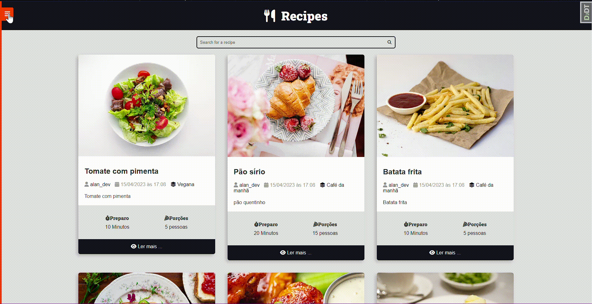

<h1 align="center"> Site de Receitas </h1>

Site de receitas moderno e bonito utilizando Django e REST framework. O projeto foi 
construído com uma abordagem de Desenvolvimento Orientado a Testes (TDD) e incluiu a 
implementação de testes unitários, integrados e funcionais e PostgreSQL como banco de 
dados

  <a href="#-tecnologias">Tecnologias</a>&nbsp;&nbsp;&nbsp;|&nbsp;&nbsp;&nbsp;
  <a href="#-projeto">Projeto</a>&nbsp;&nbsp;&nbsp;|&nbsp;&nbsp;&nbsp;
  <a href="#memo-licença">Licença</a>

  

 

  

## Barra de navegação

  

## 🚀 Tecnologias

Esse projeto foi desenvolvido com as seguintes tecnologias:

- HTML, CSS, JavaScript
- Python, Django
- PostgreSQL, Git

## 💻 Projeto

A plataforma de receitas foi desenvolvida para proporcionar uma experiência agradável aos usuários, com um design visualmente atraente e funcionalidades intuitivas. Utilizei o Django para gerenciar a estrutura do site, incluindo o roteamento de URLs, a criação de modelos de dados e a implementação de views. Para garantir a qualidade e a estabilidade do projeto, apliquei uma abordagem de desenvolvimento orientada a testes. Isso envolveu a criação de testes unitários para cada componente do sistema, testes integrados para verificar a interação entre os diferentes módulos e testes funcionais para validar a funcionalidade geral do site.

## :memo: Licença

Esse projeto está sob a licença MIT.